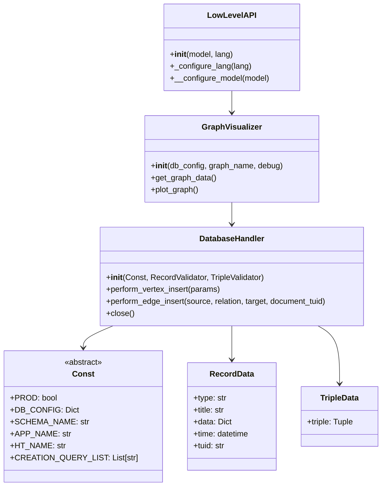

# KGraphSD - Knowledge Graph Software Development Framework

## Overview
KGraphSD is a powerful library designed for testing and developing applications using PostgreSQL as a multi-paradigm database. It provides a robust framework for building applications that leverage PostgreSQL's capabilities for vector storage, graph operations, relational data management, and time series analysis.

## Architecture
The project follows the Model-View-Controller (MVC) pattern for optimal maintainability and separation of concerns:

- **Model**: Data structures and database interactions
- **View**: User interface components (Gradio-based)
- **Controller**: Business logic and application flow

## Project Structure

```
KGraphSD/
├── libs/
│   ├── pg_engine/           # Database connector and core functionality
│   │   └── database_pg_connector.py
│   └── be_param/           # Backend implementations
│       ├── gradio_job_app/  # Job catalog application
│       └── test_app/       # Example application template
└── app_gradio.py           # Frontend implementation
```

## Key Components

### 1. PostgreSQL Engine (`pg_engine/`)
The core database connector that handles:
- Multi-paradigm database operations
- Vector storage and retrieval
- Graph operations using Apache AGE
- Relational data management
- Time series data with TimescaleDB integration

### 2. Backend Parameters (`be_param/`)
Contains backend implementations for different applications:
- `gradio_job_app/`: Job catalog application
- `test_app/`: Template for creating new applications

### 3. Frontend (`app_gradio.py`)
Gradio-based user interface that provides:
- Interactive data input forms
- Knowledge graph visualization
- Real-time data processing feedback
- Time series data visualization

## Class Diagram



## Getting Started

### Prerequisites
- PostgreSQL with Apache AGE extension
- TimescaleDB extension for time series support
- Python 3.8+
- Required Python packages (see requirements.txt)

- Debian 12 dependencies 
```
apt install postgresql-17-timescaledb postgresql-17-pgvector postgresql-17-age
```


### Configuration
All modifications should be made in the `Const` class of your application. This includes:
- Database connection parameters
- Schema names
- Vector dimensions
- SQL queries
- AGE graph configurations
- TimescaleDB hypertable settings

### Creating a New Application
1. Use `test_app` as a template
2. Create a new directory in `be_param/`
3. Implement your application's specific logic
4. Modify the `Const` class for your needs
5. Create a new Gradio interface or extend the existing one

## Best Practices
1. Always extend the `Const` class for application-specific configurations
2. Use the provided data validation classes (`RecordData`, `TripleData`)
3. Follow the MVC pattern for new features
4. Implement proper error handling and logging
5. Use type hints for better code maintainability
6. Leverage TimescaleDB for efficient time series data management

## Contributing
1. Fork the repository
2. Create a feature branch
3. Commit your changes
4. Push to the branch
5. Create a Pull Request

